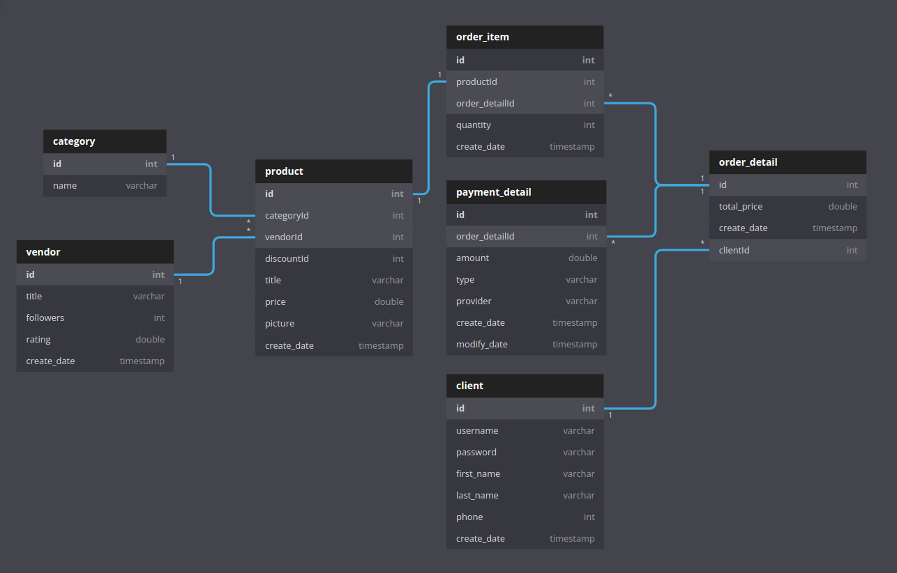
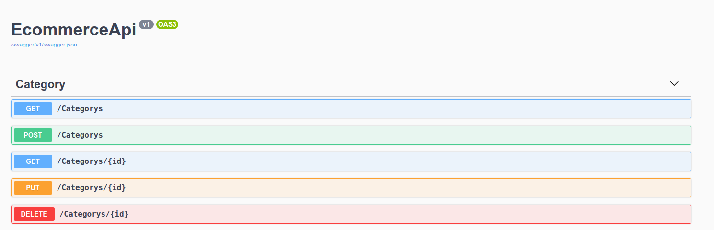

# Backend Side of the FullStack Ecommerce App

## Description

While reading this README file you can dive into to the details of the backend side of the project.

## How to setup?

In the first installation, the database migrations and also data generator needs to be applied correctly.

Firstly you need to create a database ```appdb``` on SQL Server. The CLI commands below are the answer for how to easily create a database on SQL Server. 

```
$ sqlcmd -S localhost -U SA -P '<YOUR PASSWORD>'
1> USE master;
2> GO
1> CREATE DATABASE appdb;
2> GO
```

You need to build the dependencies after initializing a new database,

```
# cd Backend
$ dotnet build EcommerceApi.csproj
```

Then do the migration as follows,

```
$ dotnet ef migrations add initial
$ dotnet ef database update
```

After migration go to the Data -> DataGenerator.cs file Line 347. Data seeding is applied by commenting out and commenting again for each entity. The reason is when applying them together, it raises a foreign key error which I couldn't fix for saving time.

Finally you can start your backend

```
$ dotnet run watch
```

## Abstract

This project is built with the technical stack:

- .NET Core
- C#
- MSSQL (for database)
- Swagger UI

Libraries:

- Entity Framework Core
- Dependency Injection
- Automapper

## Database Design

The database has been designed with Entity Relationship Schema as follows

## ER (Entity-Relationship) Schema



## .NET Core application for database configuration and transactions

### Entities

The entities used in the project are as follows.

- Category
- Client
- OrderDetail
- OrderItem
- PaymentDetail
- Product
- Vendor

### API Design

The operations for the entities are developed with the RESTful principle which supports CRUD operations:

- C: Create
- R: Read
- U: Update
- D: Delete

Example for configured operations at below,

