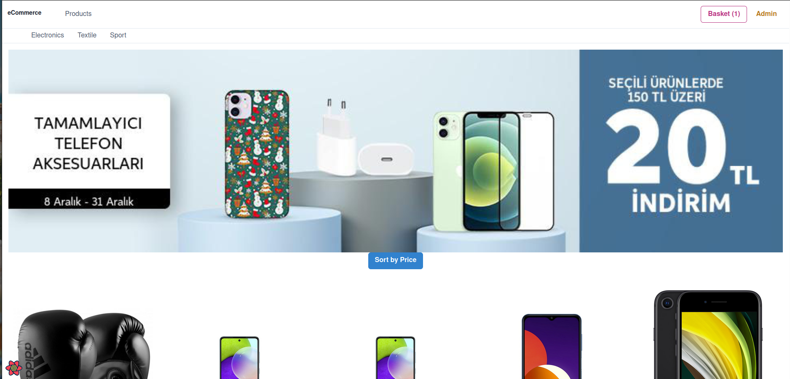
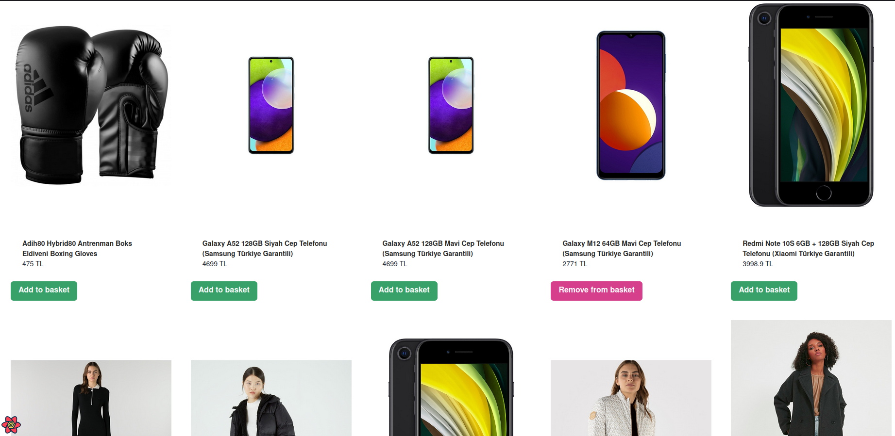
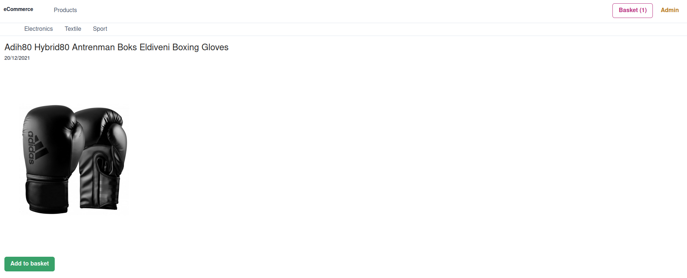
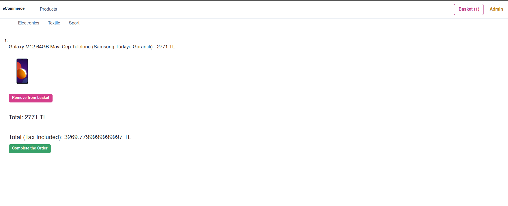
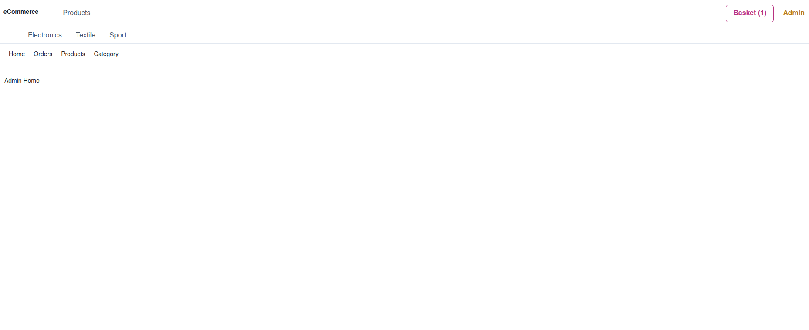
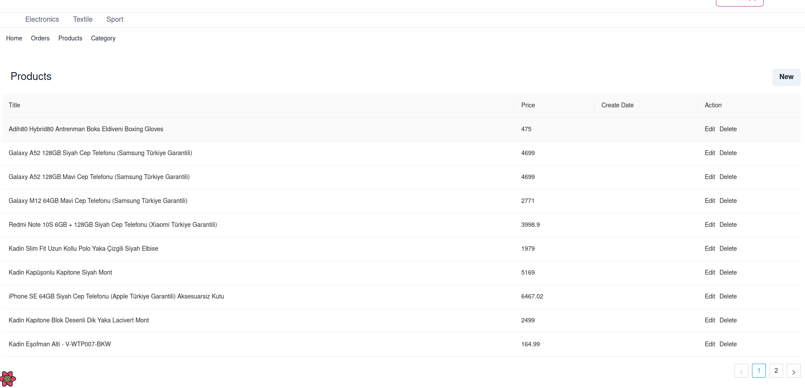
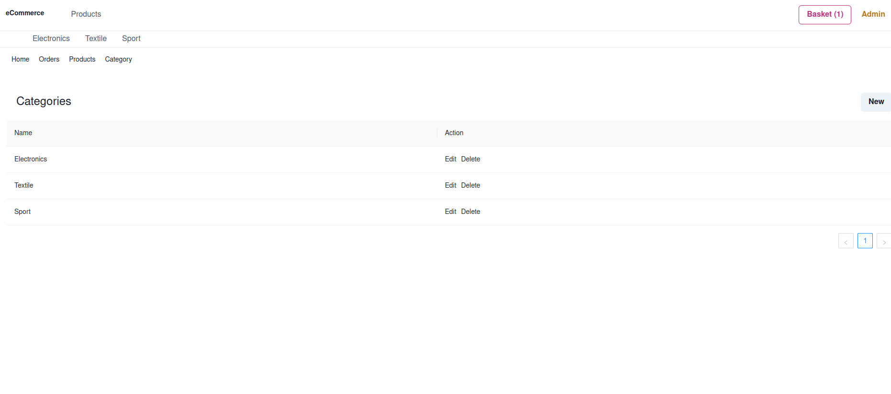

# Frontend side of the Final Project




## Description

While reading this README file you can dive into to the details of the frontend side of the project.

## How to setup?

Firstly, you need to setup the dependecies through installing the packages stated within the ```package-lock.json``` file.

```
$ cd Frontend/eCommerceApp
$ npm install
```

Once installation is complete, you can test the application via,

NOTE: Firstly, run the backend side!

```
npm start
```

Enjoy the shopping!

## Screenshots from the App

- The products in the home page



- Example product detail page



- Example of basket page



- Admin Panel





