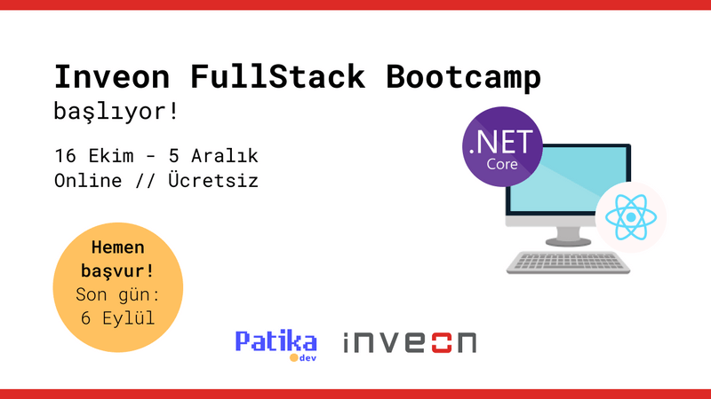

# Berke Senturk Final Homework - FullStack Ecommerce App (.NET Core & React JS)

# About 

This is my first fullstack project with .Net Core and React and my final project for completing the Inveon FullStack Bootcamp :)



The project is a fullstack project which consisting two main parts:

- Backend side: .NET Core, C#
- Frontend side: React JS

You can reach out to further details of the both sides while reading their ```README.md``` files.

- For details of the backend side of project : [backend](./Backend/README.md)
- For details of the frontend side of project : [frontend](./Frontend/README.md)

# How to download?

You need to clone the project via

```
git clone git@github.com:135-Inveon-FullStack-Bootcamp-Classroom/BerkeSenturkFinalHomework.git
```